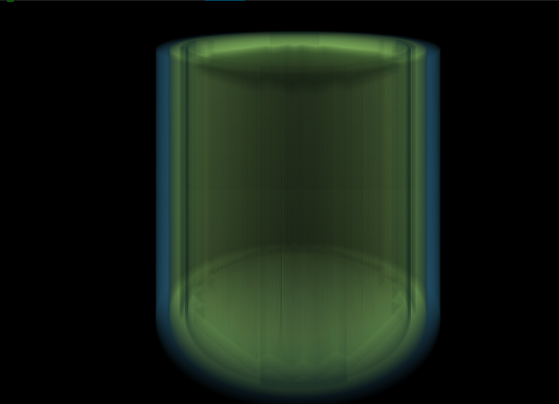

# OpenMC Explorer

This is the simplest of geometry ray tracers, which uses an extremely (ok?) system of controls, which
is very hard to use if you're not the author of the code. Of course, these shortcomings will
eventually improve. For now, here are some of the controls, and a pretty picture. Use
this tool on your OpenMC input, if you dare.

Control | Action
--------|------------------------------------------------------
  w     | Move in +x direction
  a     | Move in -y direction
  s     | Move in -x direction
  d     | Move in +y direction
  space | Move in +z direction
  shift | Move in -z direction
  up    | Move camera in +mu (polar angle)
  down  | Move camera in -mu
  right | Move camera in +phi (azimuthal)
  left  | Move camera in -phi (azimuthal)
  q     | Roll camera counterclockwise (not functioning yet)
  e     | Roll camera clockwise (^ ditto)
  r     | Increase horizontal field of view
  f     | Decrease horizontal field of view
  t     | Increase vertical field of view
  g     | Decrease vertical field of view
  j     | Decrease model opacity
  k     | Increase model opacity
  c     | Re-randomize model material colors

